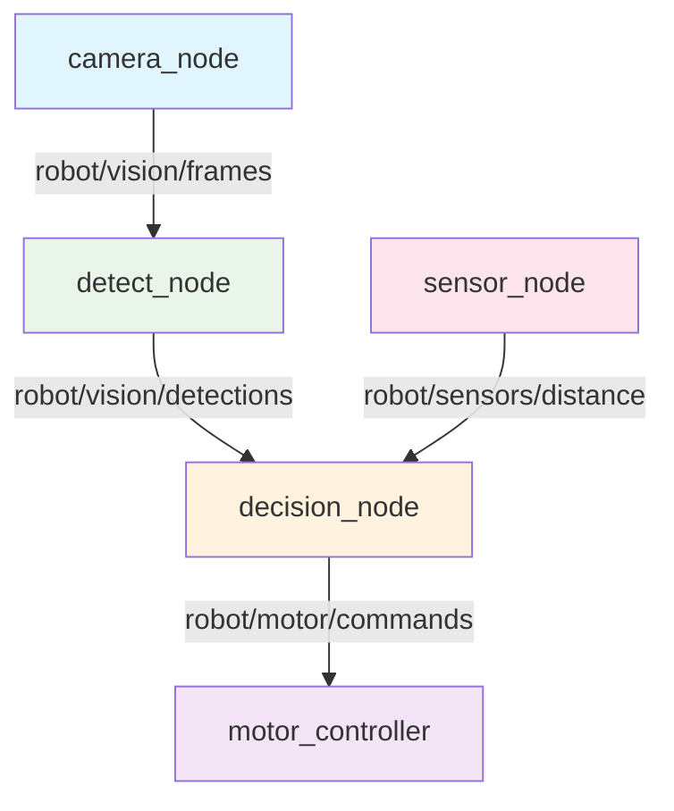

# 🤖🌴 Beach-Sweep

Beach-Sweep es un robot autónomo diseñado para mantener las playas limpias, recogiendo basura (especialmente latas) y depositándolas en un contenedor rojo. Utiliza lo último en tecnología de visión artificial y sensores, garantizando eficiencia y seguridad en cada recorrido. ♻️

El software está estructurado en paquetes independientes para visión, sensores, decisiones y motores, todos integrados en ROS 2. Esto permite facilidad de mantenimiento y escalabilidad para futuras mejoras.

## 🛠️ ¿Cómo funciona?
 - 👁️‍🗨️ Visión Artificial: Gracias a un modelo YOLO, el robot detecta latas y otros objetos en la arena usando una cámara.
 - 📡 Sensor LiDAR: Mide distancias y detecta obstáculos en tiempo real, asegurando una navegación segura por la playa.
 - 🧠 Lógica Autónoma: Una máquina de estados controla el comportamiento: buscar, navegar, recoger y depositar la basura.
 - 🚗 Control de Motores: Sistema de ruedas, escoba y servos para moverse, recolectar y vaciar las latas en el depósito rojo.

## 🏗️ Estructura del Proyecto

```
Beach-Sweep/
├── 📄 README.md
├── 📄 TESTING.md
└── src/
    ├── 📦 robot_interfaces/           # Mensajes personalizados (CMake)
    │   ├── CMakeLists.txt
    │   ├── package.xml
    │   ├── msg/
    │   │   ├── Detection.msg          # Detección individual YOLO
    │   │   └── Detections.msg         # Array de detecciones
    │   └── resource/robot_interfaces
    │
    ├── 📦 vision_ia_core/            # Visión y coordinación (Python)
    │   ├── setup.py
    │   ├── package.xml
    │   ├── vision_ia_core/
    │   │   ├── camera_node.py         # Captura de video/cámara
    │   │   └── detect_node.py         # Detección YOLO + clasificación
    │   ├── launch/
    │   │   ├── vision.launch.py       # Solo componentes de visión
    │   │   └── robot_system.launch.py # Sistema completo integrado
    │   └── data/
    │       ├── yolo11n.pt            # Modelo YOLO pre-entrenado
    │       └── video_latas.mp4       # Video de testing
    │
    ├── 📦 sensor_package/            # Sensor LiDAR TF-Luna (Python)
    │   ├── setup.py
    │   ├── package.xml
    │   ├── sensor_package/
    │   │   └── sensor_node.py         # Lectura serial + publicación Range
    │   └── launch/sensor.launch.py
    │
    ├── 📦 motor_package/             # Control de motores (Python)
    │   ├── setup.py
    │   ├── package.xml
    │   ├── motor_package/
    │   │   └── motor_node.py          # GPIO + PWM + comandos
    │   └── launch/motor.launch.py
    │
    └── 📦 decision_package/          # Lógica de decisiones (Python)
        ├── setup.py
        ├── package.xml
        ├── decision_package/
        │   └── decision_node.py       # Máquina de estados + navegación
        └── launch/decision.launch.py
```

## 🔄 Flujo de Datos



## 🎯 Funcionalidades del Sistema

### **Vision IA Core:**

- 📹 Captura de video desde archivo o cámara USB
- 🔍 Detección YOLO de objetos (latas, botellas, contenedores)
- 📊 Publicación de detecciones con bounding boxes y confianza

### **Sensor Package:**

- 📡 Lectura del LiDAR TF-Luna via puerto serial
- 📏 Medición de distancia (0.02m - 8.0m)
- ⚠️ Detección de obstáculos para navegación segura

### **Decision Package:**

- 🧠 Máquina de estados para comportamiento autónomo
- 🎯 Estados: Buscar → Navegar → Recoger → Depositar
- 🚫 Lógica de evasión de obstáculos

### **Motor Package:**

- 🚗 Control de 4 ruedas con puentes H
- 🧹 Control de motor de escoba
- 🚪 Servos para puerta y piso de almacenamiento
- 🌀 Modo espiral para exploración

## 🚀 Comandos de Uso

### **Compilación:**

```bash
cd ~/Beach-Sweep/
source /opt/ros/jazzy/setup.bash
colcon build
source install/setup.bash
```

### **Ejecución completa:**

```bash
ros2 launch vision_ia_core robot_system.launch.py
```

### **Testing individual:**

```bash
# Solo sensores
ros2 launch sensor_package sensor.launch.py

# Solo motores
ros2 launch motor_package motor.launch.py

# Solo visión
ros2 launch vision_ia_core vision.launch.py

# Solo decisiones
ros2 launch decision_package decision.launch.py
```

### **Monitoreo:**

```bash
# Ver todos los nodos activos
ros2 node list

# Ver comunicación entre nodos
rqt_graph

# Monitorear tópicos específicos
ros2 topic echo robot/vision/detections
ros2 topic echo robot/sensors/distance
ros2 topic echo robot/motor/commands
```
